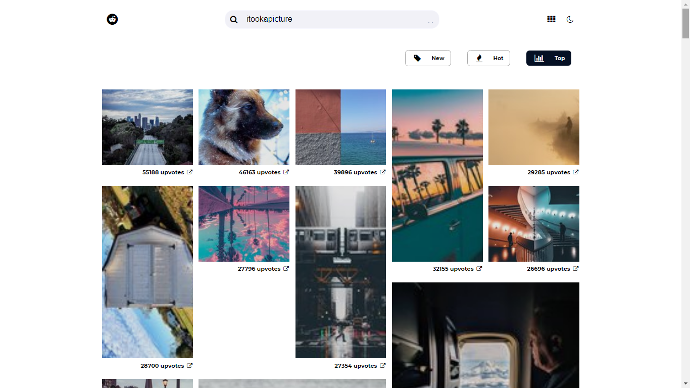
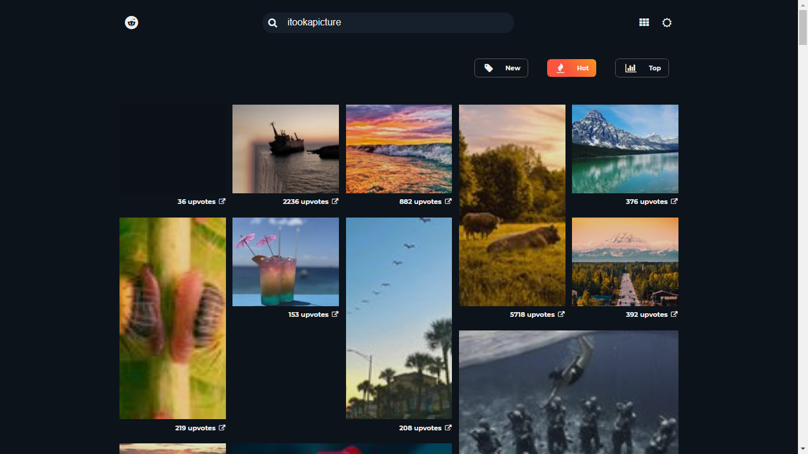

# Mosaic-Reddit

A SPA that fetches data from the public reddit API and displays images from various subreddits.

## Operation

Using the search-field, the user gets to choose a specific subreddit to pull data from --with r/pics as the default page.

## Screenshots




## Project setup

```
npm install
```

### Compiles and hot-reloads for development

```
npm run serve
```

### Compiles and minifies for production

```
npm run build
```

### Lints and fixes files

```
npm run lint
```

### Customize configuration

See [Configuration Reference](https://cli.vuejs.org/config/).
